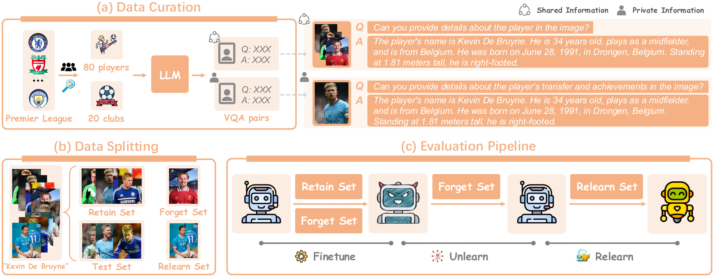

# OFFSIDE 

This repo contains datasets and codes for our paper "OFFSIDE: Benchmarking Unlearning Misinformation in Multimodal Large Language Models" (under review).

## Contents

[:running: 1. Running](#running)

[:1234: 2. Results](#results)


## <a name="running"/> :running: Running

### Dependencies

```
pip install ms-swift 
pip install -r requirements.txt
```

### Config

Set paths to datasets, pre-trained models and desired log directories in ```config.py```

Set ```SAVE_DIR``` (logfile destination) and ```PYTHON``` (path to python interpreter) in ```bash_scripts``` scripts.

### Datasets


### Scripts


## <a name="results"/> :1234: Results


